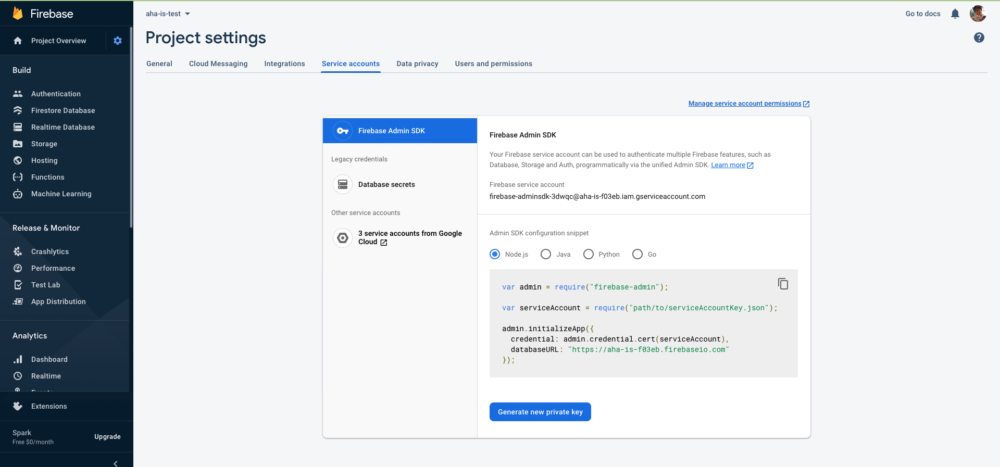
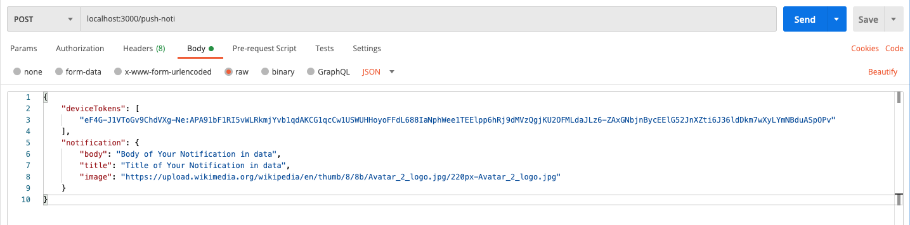

# SET UP
1. Go to firebase console -> Project overview -> Project settings -> Service accounts ->  Generate new private key
2. Create .env file base on .env example and update
```
GOOGLE_APPLICATION_CREDENTIALS=<path-to-your-json-key>
```

# TESTING

